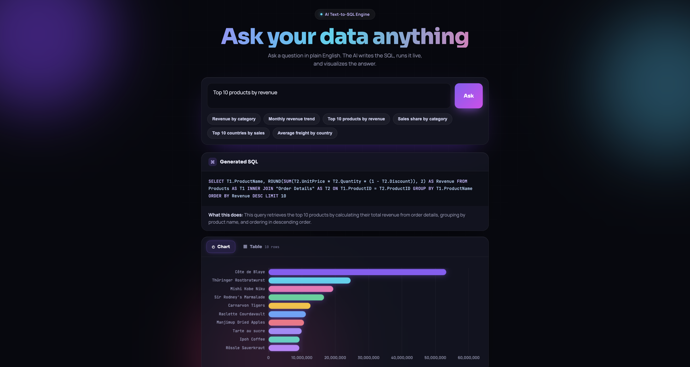

# Ask Your Data — AI Text-to-SQL Analytics Tool

Ask questions about an e-commerce database in plain English. An AI model writes the SQL, runs it against a live database, and returns the answer as a table **and** an automatic visualization.



## What it does
- Type a question like *"Top 10 products by revenue"* or *"Monthly revenue trend"*
- The AI converts it to SQL using the database schema
- The query runs live against a real SQLite database (the Northwind e-commerce dataset)
- Results appear as a sortable table and an auto-selected chart (bar, horizontal bar, line, area, or doughnut)

## Tech stack
- **Backend:** Python, Flask
- **Database:** SQLite (Northwind — ~16k orders, 600k+ line items, 21 countries)
- **AI:** Google Gemini API (text-to-SQL generation)
- **Frontend:** HTML, CSS, JavaScript, Chart.js

## How it works
1. The frontend sends the question to the `/api/ask` endpoint.
2. The backend sends the question + the database schema to Gemini, which returns the SQL, a plain-English explanation, and a suggested chart type as JSON.
3. The SQL is validated (read-only `SELECT` only — destructive statements are blocked) and run against the database in read-only mode.
4. Rows and chart spec are returned and rendered.

## Getting started
```bash
# 1. clone and enter the project
git clone https://github.com/YOUR_USERNAME/YOUR_REPO.git
cd YOUR_REPO

# 2. set up the environment
python3 -m venv .venv
source .venv/bin/activate
pip install -r requirements.txt

# 3. add your Gemini API key (free at aistudio.google.com)
export GEMINI_API_KEY="your-key-here"

# 4. run
python3 app.py
```
Then open http://localhost:5000

## Safety
- Only single read-only `SELECT` queries are allowed; `INSERT`, `UPDATE`, `DELETE`, `DROP`, etc. are blocked with a regex check.
- The database is opened in read-only mode.
- The schema is passed in the prompt so the model only references real tables and columns.

## Notes
Northwind is a well-known sample e-commerce database, used here to demonstrate the tool on realistic relational data.
